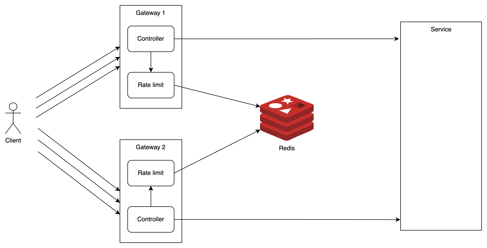
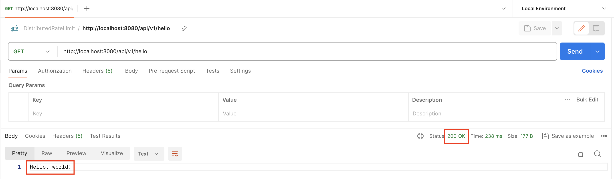
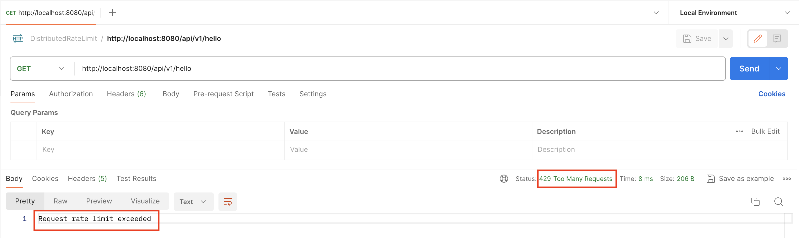

# Rate Limit Request Problem

Github: https://github.com/pmatuan/Rate-Limiting-Problem

## Vấn đề

Để hệ thống có khả năng chống lại các cuộc tấn công Brute Force Attacks và DDOS, cần phát triển module Rate Limit Request ở các API gateway service.

## 1. Coding

### Giải pháp

Để giới hạn số lượng request truy cập, cần sử dụng một giải thuật phù hợp. Với dữ liệu đầu vào là thời gian, các giải thuật như `Fixed window counter`, `Sliding window counter` và `Sliding window log` là lựa chọn phù hợp.

Em lựa chọn implement giải thuật `Sliding window log` để giải quyết bài toán trên do giải thuật này có tính chính xác cao nhất trong 3 giải thuật. Hướng dẫn chi tiết về cách chạy đã được viết trong file README.md trong thư mục RateLimit.

## 2. Design

### Functional requirements

- Giới hạn số lượng request truy cập đến các services trong khoảng thời gian nhất định.

  Ví dụ: 10 request/s.

- Với request được phép truy cập, response dữ liệu cho client như bình thường.

- Với request không được phép truy cập, response status code 429 (Too Many Requests).

### Nonfunctional requirements

- Thời gian đáp ứng nhanh, không khiến giảm hiệu năng các services hiện có.
- Trong trường hợp DistributedRateLimit gặp lỗi, vẫn cho phép truy cập để không làm ảnh hưởng đến hệ thống hiện tại.

### High Level Design

Dưới đây là high level design của hệ thống phiên bản cũ:

Trong phiên bản cũ, hệ thống chỉ sử dụng một API Gateway. Các dữ liệu dùng giúp Rate Limit Request chỉ được lưu trong biến của chương trình.

#### Yêu Cầu Mới

Hệ thống cần triển khai API Gateway dưới dạng một cluster. Vì vậy, em scale API Gateway như sau:

Tuy nhiên, một vấn đề nảy sinh: Các thông tin giúp Rate Limit Request đang được lưu trong biến của chương trình Rate Limit tại mỗi API Gateway, dẫn đến việc lọc yêu cầu không chính xác.

Ví dụ: Hệ thống cho phép 10 request/s truy cập vào services. Client gửi 50 request đến mỗi API Gateway, và mỗi API Gateway cho phép 10 request đi qua. Như vậy, trong một giây có thể có đến 20 request được truy cập vào services, không đáp ứng đúng yêu cầu.

Do đó, cần có một nơi để lưu trữ dữ liệu dùng để lọc các yêu cầu. Em lựa chọn Redis vì tốc độ nhanh, giúp giảm thời gian thực hiện.

Khi sử dụng Redis để lưu trữ, cần đảm bảo không xảy ra trường hợp 2 hoặc nhiều Rate Limit truy cập đồng thời vào cùng một bản ghi trong cùng một thời điểm. Để giải quyết vấn đề này, em sử dụng cơ chế lock ở Rate Limit.

Dưới đây là high level design mới của hệ thống:

### Demo

Em triển khai một phiên bản demo của hệ thống dựa trên high level design được mô tả ở trên. Hệ thống cho phép xử lý 2 request/s, cụ thể:

Em tạo 2 "Gateway" demo tạo bằng Spring Boot.

Người dùng gọi đến 2 Gateway này:

- Nếu được truy cập vào service, Gateway sẽ chuyển tiếp sang service và service trả về thông tin cho Client (Thông tin trả về là "Hello, World!")

- Nếu không được truy cập, Gateway sẽ trả về "Request rate limit exceeded" với status 429 (Too Many Requests)

Mã nguồn demo có trong thư mục DistributedRateLimitDemo

